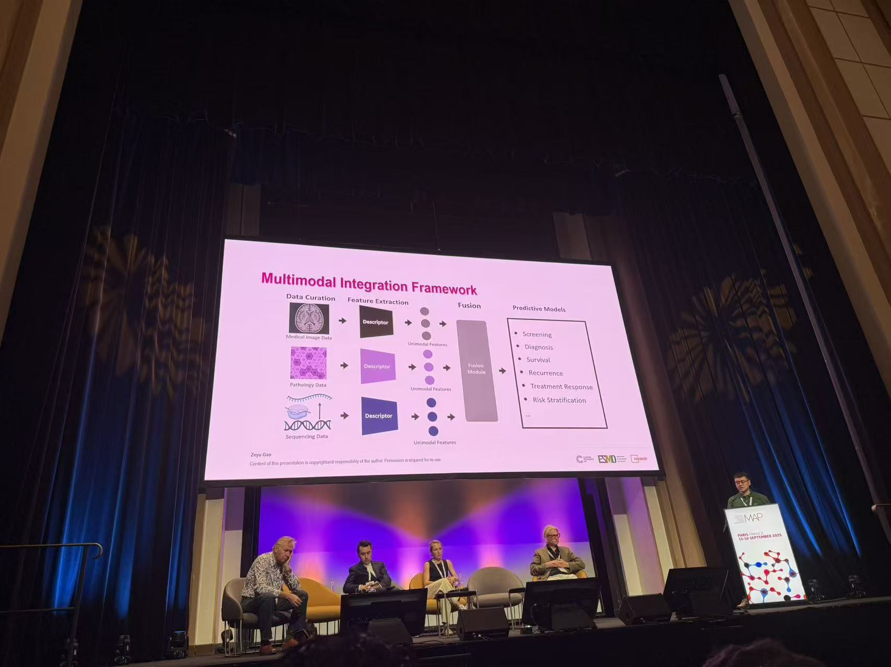
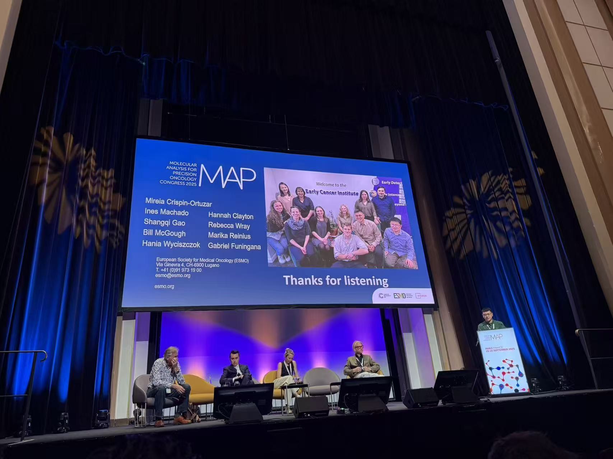

Honoured to give an invited talk on “Multiomics for Cancer” at the [ESMO Molecular Analysis for Precision Oncology Congress 2025](https://www.esmo.org/meeting-calendar/molecular-analysis-for-precision-oncology-congress-2025/programme).

  
  

