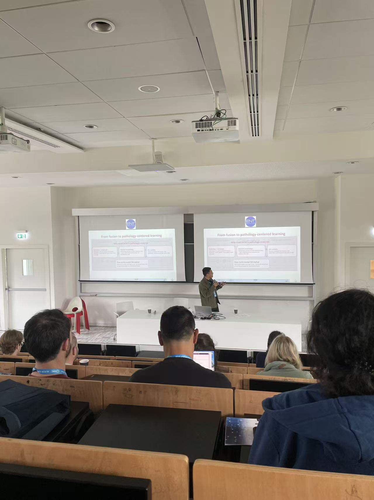
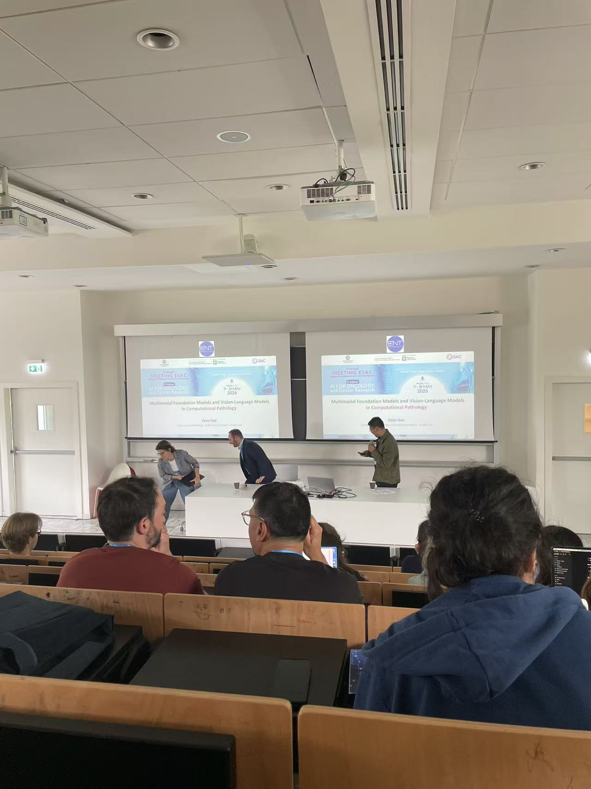
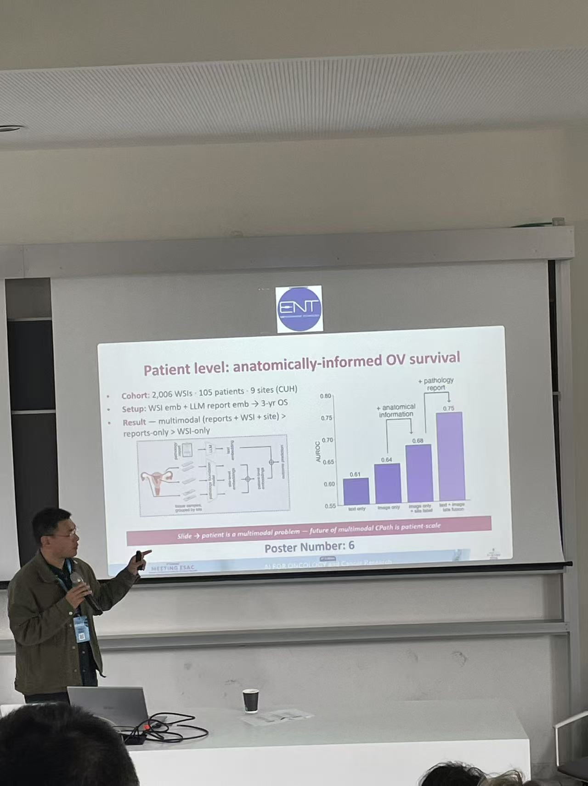

Invited speaker at the [Artificial Intelligence for Oncology Conference 2026](https://www.aiforoncology.it/) in Milan, where I presented “Multimodal foundation models and vision-language models in computational pathology.”

  
  

  

